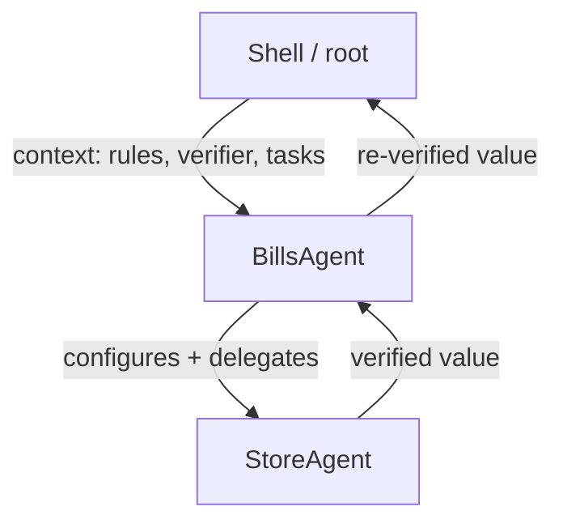
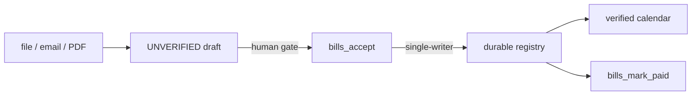

# 🧭 Agent-centric

**A deterministic system for governed, verifiable agents — where the topology is
the governance.**

Agent-centric is an **abstract, general-purpose agent system**. It is a
local-first core built around one idea: an **Agent** is simultaneously a worker
to its parent and a manager to its children, and together they form a rooted,
recursive **tree**. Work flows **down** as directives; verified responses and
responsibility bubble **up**. Every step is recorded, and every tool and model
call is mediated.

> This repository currently hosts **two lines**: the `main` branch carries the
> prior **Manager-line** (a central `AgentManager`), and this
> `agent-centric-fbp` branch carries the **FBP subsystem** — the rooted,
> manager-less tree that is the active architecture. This README is oriented to
> the FBP branch while keeping `main`'s Manager-line documented below.

---

## 📦 Badges


---

## 🗺️ Table of contents

- [Why it exists](#star2-why-it-exists)
- [How to think about it (conceptual)](#thinking-how-to-think-about-it)
- [How it compares to other agent harnesses](#balance_scale-how-it-compares-to-other-agent-harnesses)
- [The FBP subsystem](#zap-the-fbp-subsystem)
- [The bills loop — the mission-critical arc](#receipt-the-bills-loop)
- [Quick start](#rocket-quick-start)
- [Use from Zed (ACP)](#electric_plug-use-from-zed-acp)
- [The Manager-line (main branch)](#building_construction-the-manager-line-main)
- [Operator path](#desktop_computer-operator-path)
- [Correctness posture](#shield-correctness-posture)
- [Layout](#open_file_folder-layout)
- [References](#book-references)
- [License](#scroll-license)

---

## ⭐ Why it exists

Autonomous agents are only useful if you can **trust what they did**. Agent-centric
treats *correctness under autonomy* as the core problem:

- 🔒 **No unverified success.** A task terminates in a verified result or an
  explicit, audited failure — there is no ambiguous third state.
- 🎯 **Deterministic control plane.** Identical inputs + a deterministic agent
  ⇒ the same trajectory and outcome, every time.
- 🧾 **Full auditability.** Every step, tool call, policy decision, and
  cancellation is recorded durably and reconstructible after restart.
- 🚪 **Fail-closed by default.** Anything unexpected is an explicit, recorded
  failure — never a silent success.

The non-negotiable rules that govern every decision in this repository live in
[`PRINCIPLES.md`](PRINCIPLES.md).

---

## 💭 How to think about it

Most agent frameworks give you a **flat pool of agents** and a **central
orchestrator** that decides who runs when. Agent-centric turns that upside down:

> **There is no central manager. The topology *is* the governance.**

Picture a tree. The **root** is the shell — the origin of work and the final owner
of responsibility. Work travels from the root, **down** the branches, to the
leaves. Each node tries to resolve a task itself; if it can't, it delegates to its
children, handing them the **context** they need (rules, verifiers, allowed
tasks). When a child answers, each parent **re-verifies that child's value**
before accepting responsibility for it and passing it back up.



The result is a **recursive verification hierarchy**: every node is governed by its
parent, and trust is re-established at every hop on the way up. A child that
claims `verified` but returns a value its parent can't confirm is **demoted to an
explicit, audited failure** — never a silent win.

This is what makes the system mission-appropriate: it can be trusted to carry
**money and schedule** through a human-gated pipeline, because the correctness
spine holds at every level of the tree.

---

## ⚖️ How it compares to other agent harnesses

| Dimension | **Agent-centric (FBP)** | Classic manager / orchestrator | LangChain / semantic-OMRE | Autogen-ish multi-agent |
| --- | --- | --- | --- | --- |
| **Governance** | Topology: parent governs child | Central `Manager` object | Pipeline/composable steps | Chat-based role distribution |
| **Trust model** | Re-verified on every hop upward | Manager stamps verified | Per-stage determined by the runner | Conversational, loosely verified |
| **State** | Single-writer, durable, idempotent grants | Single-writer trajectory | In-process memory | In-memory, non-durable |
| **Replay** | Deterministic + crash-safe durable replay | Deterministic replay | Not a first-class concern | Not first-class |
| **Underlying graph** | Rooted tree (recursive, deterministic) | Manager-drawn composition | Directed graph | Ad-hoc graph |

The table is deliberately honest: it describes *aspirations* vs. today's concrete
capabilities. The FBP column lists what is **implemented and tested**; the
others are representative sketches.

---

## ⚡ The FBP subsystem

The **`agent-centric-fbp`** branch is a rooted, recursive **tree of agents** with
**no central manager**. It is run through a synchronous, easy-UX `FbpDriver`.

| Capability | What it guarantees |
| --- | --- |
| **Protocol + transport parity** | One enforced wire contract on `inproc://` / `tcp://` / `ipc://`. |
| **Correctness spine** | A parent re-verifies a child on the way up; self-claimed `verified` never trusted. |
| **Durable single-writer state** | `StateStore` + `TrajectoryStore`; persistence is always an explicit grant. |
| **Bills loop** | intake → human-gated accept → registry → verified calendar. |
| **Intake** | `draft_from_file` / `_email` / `_pdf_text` → unverified drafts. |
| **Registry maintenance** | `bills_mark_paid` / `bills_mark_status` → paid bills leave the calendar. |
| **Allowlisted workspace** | Fail-closed file access under an explicit allowlist. |
| **Tree-audit proof** | Reconstruct every causal chain per correlation id. |
| **Deterministic + crash-safe replay** | Durable ledger, auto-seeded, verifies after the process is gone. |
| **Plans + observation** | `run_plan`, `summary()` / `summarise_ledger`. |

Run the whole story:

```sh
uv run agent-centric fbp
uv run agent-centric fbp --transport tcp
uv run agent-centric fbp --transport ipc
```

Deep dive: [`README_FBP.md`](README_FBP.md) and [`docs/fbp.md`](docs/fbp.md).

---

## 🧾 The bills loop — the mandatory arc

Money and schedule, with a **human in the loop** — nothing auto-accepts:



---

## 🚀 Quick start

Requires Python **≥ 3.13** and [uv](https://docs.astral.sh/uv/).

```bash
uv sync --extra dev
uv run pytest
uv run ruff check .
uv run mypy
```

Run the FBP demo or the operator CLI:

```bash
uv run agent-centric fbp
uv run agent-centric run
```

The CLI is **local-only and fail-closed** — it never starts a network service,
never reads credentials, and exits non-zero on any failure.

---

## 🔌 Use from Zed (ACP)

Agent-centric can appear as an **External Agent** in Zed via the Agent Client
Protocol (ACP). Every prompt routes through the tree/Manager; no ACP path can
produce a verified success that bypasses the verification spine.

### Configure the agent server

Add to Zed's `settings.json` (Zed → Settings → Agents):

```json
{
  "agent_servers": {
    "Agent-centric": {
      "type": "custom",
      "command": "uv",
      "args": ["run", "agent-centric-acp"]
    }
  }
}
```

Start a thread in the **Agents Panel**, pick **Agent-centric**, and try prompts
that map to deterministic demo tasks.

---

## 🏗️ The Manager-line (main branch)

The `main` branch still carries the prior **Manager-driven** architecture — an
`AgentManager` that mediates every tool/model call, policy, envelope, and
verification. It is manager-orchestrated and shares the same "no unverified
success, fail-closed, full audit, deterministic" posture. It is intact and
contained on `main`; this FBP branch builds the future.

---

## 💻 Operator path

`agent-centric` is a local, fail-closed operator CLI.

| Command | Purpose |
| --- | --- |
| `run` | Run the deterministic demo task set and persist trajectories. |
| `summarise <id>` | Print a trajectory's deterministic summary. |
| `replay-verify <id>` | Re-run the demo task and verify equivalence. |
| `fbp` | Drive the FBP demo (`--transport inproc|tcp|ipc`, `--ledger <path>`). |
| `fbp-summary <path>` | Operator readout of a durable FBP ledger. |
| `fbp-replay <path>` | Re-verify an FBP ledger in a fresh process. |

Example:

```sh
uv run agent-centric fbp --ledger ses.db      # record a session durably
uv run agent-centric fbp-summary ses.db       # observe it
uv run agent-centric fbp-replay ses.db        # re-verify 18/18 runs
```

---

## 🛡 Correctness posture

- **Model and tool outputs are untrusted until verified.**
- **Verification is real**, re-derived from the payload — never a stub.
- **Failure is first-class**: verification, policy, envelope, tool denial, child
  crash — all explicit, audited.
- **Real providers are opt-in**; CI default is the deterministic stub (no
  network, no credentials).
- **Replay is read-only** and deterministic.

---

## 📂 Layout

```
PRINCIPLES.md          Non-negotiable governing rules
KERNEL.md              v0 kernel freeze note
STATUS.md              Volley history + correctness evidence
README_FBP.md          The FBP deep-dive (this branch)
src/agent_centric/
  fbp/                 The FBP subsystem (active)
  contracts/           Versioned contracts
  control_plane/       Manager (main) control plane
examples/              Demos
tests/                 Invariants across every volley
```

---

## 📚 References

| Doc | What it's for |
| --- | --- |
| [`docs/fbp.md`](docs/fbp.md) | FBP easy-UX driver companion. |
| [`src/agent_centric/fbp/spec.md`](src/agent_centric/fbp/spec.md) | FBP architecture spec. |
| [`src/agent_centric/fbp/protocol.md`](src/agent_centric/fbp/protocol.md) | FBP wire contract. |
| [`README_FBP.md`](README_FBP.md) | Story-led FBP deep-dive. |
| [`PRINCIPLES.md`](PRINCIPLES.md) | Non-negotiable rules. |
| [`KERNEL.md`](KERNEL.md) | v0 freeze note + versioning. |
| [`STATUS.md`](STATUS.md) | Volley-by-volley history + correctness evidence. |
| [`HANDOFF.md`](HANDOFF.md) | Session continuity one-pager (main). |
| [`docs/FBP_HANDOFF.md`](docs/FBP_HANDOFF.md) | Session continuity one-pager (FBP). |

---

## 📄 License

[Mozilla Public License 2.0](LICENSE).