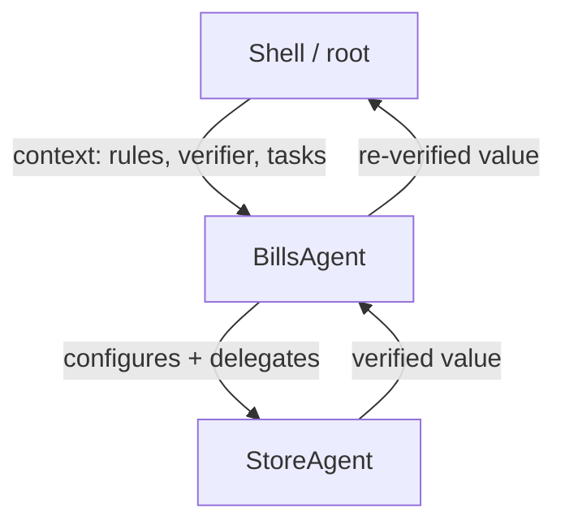
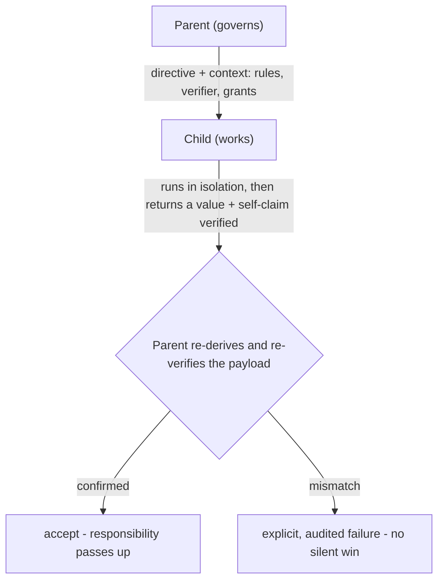
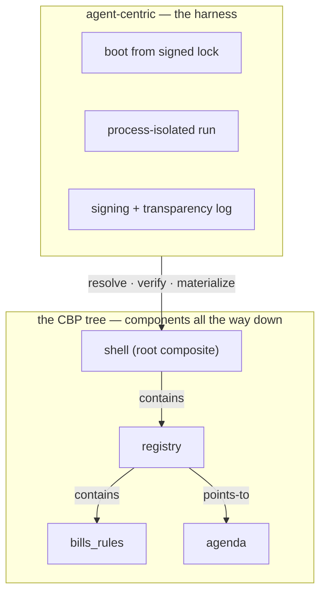
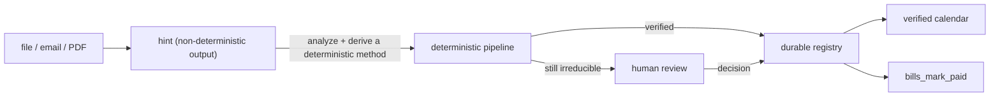

<div align="center">

<a href="https://github.com/makeroftools/agent-centric">
  
</a>

# Agent-centric

**A deterministic platform for governed, verifiable agents — where the topology _is_ the governance.**

[](https://github.com/makeroftools/agent-centric/actions/workflows/gates.yml)
[](https://www.python.org/)


[](https://github.com/makeroftools/agent-centric/actions/workflows/gates.yml)

[](LICENSE)


**Deterministic · Local-first · Fail-closed · Fully auditable · No unverified success**

</div>

---

## Table of contents

- [Why it exists](#why-it-exists)
- [How to think about it](#how-to-think-about-it)
- [Architecture](#architecture)
- [How it compares to other agent harnesses](#how-it-compares-to-other-agent-harnesses)
- [The CBP subsystem](#the-cbp-subsystem)
- [The bills loop (worked example)](#the-bills-loop-worked-example)
- [Quick start](#quick-start)
- [Use from Zed (ACP)](#use-from-zed-acp)
- [Operator path](#operator-path)
- [Correctness posture](#correctness-posture)
- [Layout](#layout)
- [Roadmap](#roadmap)
- [Development](#development)
- [References](#references)
- [License](#license)

---

## Why it exists

Autonomous agents are only useful if you can **trust what they did**. Agent-centric
treats *correctness under autonomy* as the core problem:

- 🔒 **No unverified success.** A task terminates in a verified result or an
  explicit, audited failure — there is no ambiguous third state.
- 🎯 **Deterministic control plane.** Identical inputs + a deterministic agent
  ⇒ the same trajectory and outcome, every time.
- 🧾 **Full auditability.** Every step, tool call, policy decision, and
  cancellation is recorded durably and reconstructible after restart.
- 🚪 **Fail-closed by default.** Anything unexpected is an explicit, recorded
  failure — never a silent success.

**The platform itself is deterministic.** Non-deterministic tools (a model, a
free-form parser) are inputs to the platform — useful, but not treated as
authoritative: their output is a suspect to be captured, re-derived, and checked
against a deterministic rule before it counts. Determinism is a feature of the
*platform*; it is not diluted by the tools it uses.

The non-negotiable rules that govern every decision in this repository live in
[`PRINCIPLES.md`](PRINCIPLES.md).

> **Scope.** This is an **abstract, general-purpose** agent system. The
> mission-critical posture — correctness, determinism, verification, audit,
> fail-closed — applies to the system itself, not to any particular domain.

---

## How to think about it

Most agent frameworks give you a **flat pool of agents** and a **central
orchestrator** that decides who runs when. Agent-centric turns that upside down:

> **There is no central manager. The topology *is* the governance.**

Picture a tree. The **root** is the shell — the origin of work and the final owner
of responsibility. Work travels from the root, **down** the branches, to the
leaves. Each node tries to resolve a task itself; if it can't, it delegates to its
children, handing them the **context** they need (rules, verifiers, allowed
tasks). When a child answers, each parent **re-verifies that child's value**
before accepting responsibility for it and passing it back up.


```mermaid
flowchart TD
    Root["Shell / root"] -->|"context: rules, verifier, tasks"| Bills["BillsAgent"]
    Bills -->|"configures + delegates"| Store["StoreAgent"]
    Store -->|"verified value"| Bills
    Bills -->|"re-verified value"| Root
```

The result is a **recursive verification hierarchy**: every node is governed by its
parent, and trust is re-established at every hop on the way up.


```mermaid
flowchart TD
    P["Parent (governs)"] -->|"directive + context: rules, verifier, grants"| C["Child (works)"]
    C -->|"runs in isolation, then returns a value + self-claim verified"| V{"Parent re-derives and re-verifies the payload"}
    V -->|"confirmed"| A["accept - responsibility passes up"]
    V -->|"mismatch"| F["explicit, audited failure - no silent win"]
```

A child that claims `verified` but returns a value its parent can't confirm is
**demoted to an explicit, audited failure** — never a silent win. This is what
makes the system mission-appropriate: it can be trusted to carry **money and
schedule** through a pipeline where a human is in the loop **only where there is
genuine non-determinism** — not as a permanent checkpoint.

---

## Architecture

[`agent-centric`](specs/SPEC-0007-harness-shell-component-distribution.md) is split
into **two layers**, cleanly:

- **The harness** — boot, runtime, and meta. It *executes* the CBP tree and
  **is not a node**.
- **The shell component** — the tree's root. It is an **ordinary component**, not
  special-cased.

Everything is a **component** (a CBP node = an ABM agent): self-contained, with
local SQLite state, versioned by a `component.v1` contract. A **skill** is a
component directive; an **LLM** is a component of kind `model`.


```mermaid
flowchart TB
    subgraph Harness["agent-centric — the harness"]
        direction LR
        Boot["boot from signed lock"]
        Proc["process-isolated run"]
        Sign["signing + transparency log"]
    end

    subgraph Tree["the CBP tree — components all the way down"]
        Shell["shell (root composite)"]
        Reg["registry"]
        Rules["bills_rules"]
        Agenda["agenda"]
    end

    Harness -->|"resolve · verify · materialize"| Shell
    Shell -->|"contains"| Reg
    Reg -->|"contains"| Rules
    Reg -->|"points-to"| Agenda
```

| Guarantee | How it holds |
| --- | --- |
| **Composition, not absorption** | A component at rest has **no edges**; dependency appears only in a network document. |
| **Pinned & signed** | Components are fetched at acquisition time, pinned to an immutable commit + content hash, signature-verified, and cached offline. |
| **Subnets** | A composite is a network used as a component, exposing only declared **external ports**. |
| **Sovereignty** | A child owns its state; siblings never write each other; effects propagate up as verified proposals. |

Deep dives: [`docs/agent/architecture.md`](docs/agent/architecture.md),
[`specs/SPEC-0002-cbp-component-architecture.md`](specs/SPEC-0002-cbp-component-architecture.md).

---

## How it compares to other agent harnesses

| Dimension | **Agent-centric (CBP)** | Classic manager / orchestrator | LangChain / semantic-OMRE | Autogen-ish multi-agent |
| --- | --- | --- | --- | --- |
| **Governance** | Topology: parent governs child | Central `Manager` object | Pipeline/composable steps | Chat-based role distribution |
| **Trust model** | Re-verified on every hop upward | Manager stamps verified | Per-stage determined by the runner | Conversational, loosely verified |
| **State** | Single-writer, durable, idempotent grants | Single-writer trajectory | In-process memory | In-memory, non-durable |
| **Replay** | Deterministic + crash-safe durable replay | Deterministic replay | Not a first-class concern | Not first-class |
| **Underlying graph** | Rooted tree (recursive, deterministic) | Manager-drawn composition | Directed graph | Ad-hoc graph |

The table is deliberately honest: it describes *aspirations* vs. today's concrete
capabilities. The CBP column lists what is **implemented and tested**; the others
are representative sketches.

---

## The CBP subsystem

The **CBP subsystem** is a rooted, recursive **tree of agents** with **no central
manager**. It is run through a synchronous, easy-UX `CbpDriver`.

| Capability | What it guarantees |
| --- | --- |
| **Protocol + transport parity** | One enforced wire contract on `inproc://` / `tcp://` / `ipc://`. |
| **Correctness spine** | A parent re-verifies a child on the way up; a child's self-claim is not conclusive on its own. |
| **Durable single-writer state** | `StateStore` + `TrajectoryStore`; persistence is always an explicit grant. |
| **Bills loop** *(worked example)* | intake → human review only where there's non-determinism → registry → verified calendar. |
| **Intake** | `draft_from_file` / `_email` / `_pdf_text` → unverified drafts. |
| **Registry maintenance** | `bills_mark_paid` / `bills_mark_status` → paid bills leave the calendar. |
| **Allowlisted workspace** | Fail-closed file access under an explicit allowlist. |
| **Tree-audit proof** | Reconstruct every causal chain per correlation id. |
| **Deterministic + crash-safe replay** | Durable ledger, auto-seeded, verifies after the process is gone. |
| **Plans + observation** | `run_plan`, `summary()` / `summarise_ledger`. |

Run the whole story:

```sh
uv run agent-centric cbp
uv run agent-centric cbp --transport tcp
uv run agent-centric cbp --transport ipc
```

Deep dive: [`docs/cbp.md`](docs/cbp.md).

---

## The bills loop (worked example)

> **This is a worked example, not a built-in domain.** *Bills* is a
> demonstration scenario chosen to exercise the deterministic pipeline and the
> verification spine end-to-end (intake → derive a method → verified registry →
> calendar). Agent-centric is **domain-agnostic** — the same tree, contracts, and
> gates apply to any domain. See [`PRINCIPLES.md`](PRINCIPLES.md) §2a. The
> **CBP subsystem**, not this example, is the product.

Bills are money and schedule. The governing rule is: **we never rely on a
non-deterministic output directly.** Anything that looks non-deterministic — parsing free-form
prose, email, or a PDF — is treated as a *hint*, not an answer. We analyze it and
**turn it into a deterministic method to every degree it physically can be** (a
fixed parser, a stable rule, a recomputable transform). Only the small, genuinely
irreducible residue — the judgment a deterministic procedure genuinely cannot
reach — goes to the human to review:


```mermaid
flowchart LR
  A[file / email / PDF] --> B["hint (non-deterministic output)"]
  B -->|analyze + derive a deterministic method| D["deterministic pipeline"]
  D -->|"still irreducible"| H[human review]
  D -->|"verified"| R[durable registry]
  H -->|"decision"| R
  R --> E[verified calendar]
  R --> F[bills_mark_paid]
```

The practical consequence for the human: they are **not** a checkpoint for every
item. They review only the residue that resists determinization — and the system
works to make that residue as small as it possibly can be.

> *Status:* today the acceptance step is always explicit (a safe default). The
> determinize-fully, then human-review-only-the-residue flow is where this
> repository is heading, and isolating the true irreducible decisions for the
> human to review is precisely the aim.

---

## Quick start

Requires Python **≥ 3.13** and [uv](https://docs.astral.sh/uv/).

```bash
uv sync --extra dev
uv run pytest
uv run ruff check .
uv run mypy src
```

Run the CBP demo or the operator CLI:

```bash
uv run agent-centric cbp
uv run agent-centric run
```

The CLI is **local-only and fail-closed** — it never starts a network service,
never reads credentials, and exits non-zero on any failure.

---

## Use from Zed (ACP)

Agent-centric can appear as an **External Agent** in Zed via the Agent Client
Protocol (ACP). Every prompt routes through the tree; no ACP path can produce a
verified success that bypasses the verification spine.

Add to Zed's `settings.json` (Zed → Settings → Agents):

```json
{
  "agent_servers": {
    "Agent-centric": {
      "type": "custom",
      "command": "uv",
      "args": ["run", "agent-centric-acp"]
    }
  }
}
```

Start a thread in the **Agents Panel**, pick **Agent-centric**, and try prompts
that map to deterministic demo tasks.

---

## Operator path

`agent-centric` is a local, fail-closed operator CLI.

| Command | Purpose |
| --- | --- |
| `run` | Run the deterministic demo task set and persist trajectories. |
| `summarise <id>` | Print a trajectory's deterministic summary. |
| `replay-verify <id>` | Re-run the demo task and verify equivalence. |
| `cbp` | Drive the CBP demo (`--transport inproc|tcp|ipc`, `--ledger <path>`). |
| `cbp-summary <path>` | Operator readout of a durable CBP ledger. |
| `cbp-replay <path>` | Re-verify a CBP ledger in a fresh process. |
| `cbp-check` | The deterministic readiness gate (also a CI gate). |

Example:

```sh
uv run agent-centric cbp --ledger ses.db      # record a session durably
uv run agent-centric cbp-summary ses.db       # observe it
uv run agent-centric cbp-replay ses.db        # re-verify every run
```

---

## Correctness posture

- **Model and tool outputs are untrusted until verified.**
- **Verification is real**, re-derived from the payload — never a stub.
- **Failure is first-class**: verification, policy, envelope, tool denial, child
  crash — all explicit, audited.
- **Real providers are opt-in**; the CI default is the deterministic stub (no
  network, no credentials).
- **Replay is read-only** and deterministic.
- **Acquisition is bounded**: pinned, signed, verified, and offline-capable —
  it never weakens the local-first run-time guarantee.

---

## Layout

```
AGENTS.md              Agent entry point (table of contents)
.agentfactory.toml     Active operating level (mode)
opencode.json          Harness enforcement (Law 11: edit denied)
PRINCIPLES.md          Non-negotiable governing rules
STATUS.md              Volley history + correctness evidence (historical)
HANDOFF.md             Current session-continuity one-pager
docs/                  Design/handoff docs
  agent/               Human convention map (architecture, levels, testing, …)
  assets/              Banner + mark (SVG)
  cbp.md               CBP easy-UX driver companion
.agents/skills/        Canonical Agent Skills (on-demand agent layer)
src/agent_centric/
  cbp/                 The CBP subsystem (active; ports, IPs, distribution)
  contracts/           Versioned contracts (component.v1, components.lock/v1, …)
  control_plane/       Legacy Manager control plane (frozen line)
specs/                 Specs (SPEC-0002 CBP; SPEC-0007 distribution; …)
tools/                 Sanctioned mutation primitives (safe-replace.sh, new-skill.sh)
examples/              Runnable demos; examples/components/ = example components
tests/                 Invariants across every volley
```

---

## Roadmap

**Capability is easy. Trust is the product.** The platform is built so that every
result is either *proven* or *explicitly refused* — and the roadmap is the honest
story of earning more autonomy through more verification.

The foundation is **delivered and cross-checked on two independent runtimes**. What
remains is **earned autonomy** (the L3 milestone), **self-hosting** (a platform
that deploys and heals itself), **threshold signing**, and a **research frontier**
of formal verification and bounded self-improvement.

➡️ **Read the full roadmap: [`ROADMAP.md`](ROADMAP.md)** — a plain-language guide
to where the system is today, where it is going, and the detail behind every
claim.

---

## Development

Static gates and the invariant suite run offline with the deterministic stub:

```bash
uv sync --extra dev
uv run ruff check .            # lint
uv run mypy src                # strict types
uv run agent-centric cbp-check # deterministic readiness gate
uv run pytest -p no:cacheprovider
```

Working in this repository:

- Start at [`AGENTS.md`](AGENTS.md); the constitution is [`PRINCIPLES.md`](PRINCIPLES.md).
- The active operating level is [`.agentfactory.toml`](.agentfactory.toml)
  (currently **L1 — assisted**; a human reviews every change).
- File changes are **whole-file atomic replacements** only, via
  [`tools/safe-replace.sh`](tools/safe-replace.sh) — never in-place edits.
- Commit and push continuously; pre-commit hooks and CI are the guardrails
  (never `--no-verify`).

---

## References

| Doc | What it's for |
| --- | --- |
| [`AGENTS.md`](AGENTS.md) | Agent entry point; points to every rule. |
| [`PRINCIPLES.md`](PRINCIPLES.md) | Non-negotiable rules. |
| [`HANDOFF.md`](HANDOFF.md) | Current session-continuity one-pager. |
| [`ROADMAP.md`](ROADMAP.md) | The human-facing roadmap: where we are and where we're going. |
| [`.agents/skills/`](.agents/skills) | Canonical Agent Skills (on-demand agent convention layer). |
| [`docs/agent/`](docs/agent/README.md) | Human map of the convention layer. |
| [`docs/agent/architecture.md`](docs/agent/architecture.md) | The two-layer harness/shell architecture. |
| [`.agentfactory.toml`](.agentfactory.toml) | Active operating level (mode). |
| [`docs/cbp.md`](docs/cbp.md) | CBP easy-UX driver companion. |
| [`src/agent_centric/cbp/spec.md`](src/agent_centric/cbp/spec.md) | CBP architecture spec. |
| [`src/agent_centric/cbp/protocol.md`](src/agent_centric/cbp/protocol.md) | CBP wire contract. |
| [`specs/SPEC-0002-cbp-component-architecture.md`](specs/SPEC-0002-cbp-component-architecture.md) | Target CBP component architecture. |
| [`specs/SPEC-0007-harness-shell-component-distribution.md`](specs/SPEC-0007-harness-shell-component-distribution.md) | Harness/shell split + component distribution plan. |
| [`STATUS.md`](STATUS.md) | Volley-by-volley history + correctness evidence (historical). |

---

## License

[Mozilla Public License 2.0](LICENSE).

<div align="center">


**Agent-centric — correctness under autonomy.**

Governed by [AGENTS.md](AGENTS.md) · Bound by [PRINCIPLES.md](PRINCIPLES.md) · Mode in [`.agentfactory.toml`](.agentfactory.toml)

</div>
