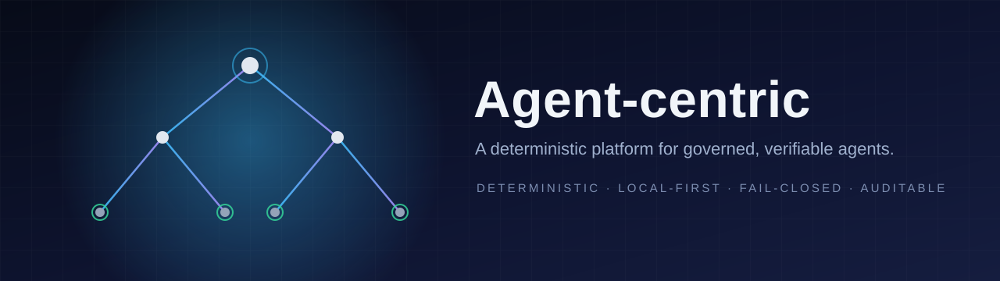
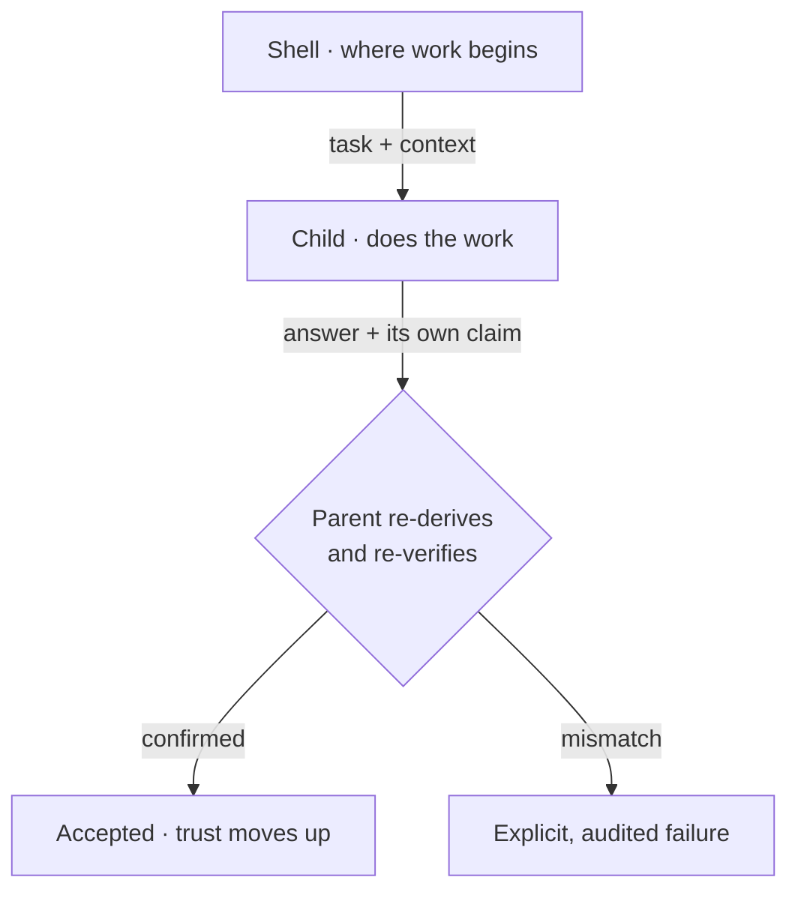

# The Roadmap

### Building the trust layer for autonomous software — one verifiable step at a time.

**Deterministic · Local-first · Fail-closed · Fully auditable**

---

## The short version

Software agents are becoming capable enough to **act on our behalf** — to move
money, manage schedules, answer customers, and eventually run infrastructure.
Capability is arriving faster than our ability to *trust* it.

Agent-centric starts from a single conviction: **the hard problem is not making
agents smarter — it is making their work verifiable.** So the platform is built so
that every result is either **proven** or **explicitly refused**, nothing is
trusted just because an AI said it, and any run can be replayed afterwards to
show exactly what happened and why.

This page is the honest map of where that platform is today and where it is
going. It is written for people, not machines, and every claim links to the
detail behind it.

> **Where we are:** the foundation is built and cross-checked. The platform runs
> **signed, content-addressed components identically on two independent
> runtimes**, can replay any run, and keeps a human in the loop only where genuine
> judgment is required. What remains is not more invention — it is **earning
> autonomy through verification**, and turning the platform into a service that
> hosts itself.

---

## Status at a glance

| Horizon | The question it answers | State |
| --- | --- | --- |
| **1. Foundation** | *Can it be trusted at all?* | ✅ **Delivered** — proven by tests on two runtimes |
| **2. Earned autonomy** | *Can it be trusted to run itself?* | 🔄 **Built, operator-gated** — one deliberate flip away |
| **3. Self-hosting** | *Can it deploy and heal itself?* | 🧭 **Specified, not yet provisioned** |
| **4. Frontier** | *How far can verification go?* | 🔬 **Research** — papers and prototypes |

---

## Why "trust" is the whole game

An agent that is right 95% of the time is, for anything that matters, an agent
you cannot use — because you can never tell which 5% is wrong.

Most agent frameworks try to fix this with **more oversight**: a bigger
orchestrator, more logs, more guardrails bolted on from outside. Agent-centric
takes a different route. It makes **verification part of the structure itself**.

Three ideas do most of the work:

1. **Nothing counts until it is verified.** A model, a parser, or a web page can
   *suggest* an answer, but the platform will not accept it until a deterministic
   rule has re-derived and confirmed it. A wrong claim is not a silent success —
   it is an explicit, recorded failure.
2. **The topology is the governance.** There is no central "manager" deciding who
   is allowed to do what. Instead, work flows down a tree and **every parent
   re-verifies its children** on the way back up. Trust is rebuilt at every step.
3. **Determinism is a property of the platform.** The platform always behaves the
   same way given the same inputs, even when the tools it uses (like an AI model)
   do not. Non-determinism is captured, bounded, and checked — never relied upon.

The non-negotiable rules behind all of this live in
[`PRINCIPLES.md`](PRINCIPLES.md).

---

## The idea in one picture

Picture a tree. At the top is the **shell** — where work begins and where final
responsibility sits. Work travels **down** the branches. Each node tries to solve
its task; if it cannot, it hands the task, *and the context needed to judge it*,
to its children. When an answer comes back up, the parent **re-checks it** before
passing it on.

The same shape repeats at every level, so the system is a **recursive
verification hierarchy**: a claim of "done" from below is never enough on its own.
That is what lets the platform carry things as consequential as **money and
schedule** while asking a human to look only at the genuinely ambiguous decisions
— not at every step.

For a deeper walk-through, see
[`docs/agent/architecture.md`](docs/agent/architecture.md) and
[`SPEC-0002`](specs/SPEC-0002-cbp-component-architecture.md).

---

## What is already built

Everything below is **implemented and tested**. "Proof" points to the machine-checked
detail if you want to go deeper.

| What it means in plain language | Proof / detail |
| --- | --- |
| **One contract for components.** An "agent" is a self-contained component with a typed interface, so any two implementations can be checked against each other. | [`SPEC-0012`](specs/SPEC-0012-component-abi.md) · [`conformance/`](https://github.com/makeroftools/cbp-conformance) |
| **Two independent runtimes agree.** A Python reference implementation and a Rust implementation produce *identical* results on the same tests. | [`SPEC-0013`](specs/SPEC-0013-cross-runtime-conformance.md) · [shared suite **31/31**](https://github.com/makeroftools/cbp-conformance) |
| **Signed, sandboxed plugins.** WebAssembly components run only after their bytes and signatures are verified; a tampered artifact is refused. | WASM suite **10/10** · [`SPEC-0013`](specs/SPEC-0013-cross-runtime-conformance.md) |
| **Networks are pinned before they run.** A wiring of components is frozen to a content hash, type-checked, and replayable; a generated network must reproduce its own pin. | [`SPEC-0014`](specs/SPEC-0014-network-execution-trust.md) · network suite **14/14** |
| **Meaning you can reason over.** A semantic graph is a pure projection of the existing contracts; capability discovery, closed shapes, and a pinned entailment closure (Datalog + stratified negation) are deterministic, bounded, canonical-sorted, and certified cross-runtime. | [`SPEC-0023`](specs/SPEC-0023-ontology-semantic-graphs.md) · ontology suite **11/11** |
| **A picture of the system.** Any validated network renders to a deterministic, read-only diagram — no surprises, no side effects. | [`docs/cbp.md`](docs/cbp.md) |
| **Appointment with evidence.** External components are admitted only from an allow-list, with a signature and zero privileges, and get a scoped "assurance label". | [`SPEC-0015`](specs/SPEC-0015-provenance-assurance-labels.md) · appointed suite **8/8** |
| **Distribution you can audit.** Components are content-addressed, signed, cached offline, and booted from a signed lock — with key rotation and an append-only transparency log. | [`SPEC-0007`](specs/SPEC-0007-harness-shell-component-distribution.md) |
| **Design, then build.** A human authors a design; the platform validates it, pins every dependency, and produces a signed lock. | [`SPEC-0008`](specs/SPEC-0008-shell-design-interface-n8n.md) |
| **A working end-to-end story.** Boot a signed lock → run a typed dataflow → replay it from a durable ledger, with a model's output recorded and confidence-scored. | [`SPEC-0011`](specs/SPEC-0011-minimum-viable-product.md) · [`HANDOFF.md`](HANDOFF.md) |
| **Every answer carries confidence.** A deterministic result is confidence 1.0; a model result carries its own score; anything uncertain can be routed to a human review queue. | [`SPEC-0002`](specs/SPEC-0002-cbp-component-architecture.md) §4/§6 |

> The current, machine-verified state (exact counts and commands) is always in
> [`HANDOFF.md`](HANDOFF.md).

---

## The road ahead

The remaining work is deliberately sequenced. Each step is **earned by
verification**, never granted by enthusiasm.

### 🔄 1. Earned autonomy — the L3 milestone

**In plain language.** Today the platform is trustworthy, but a human still signs
off on changes. The next step is a "dark factory": the system may merge its own
work **only after passing tests it was never allowed to see**. Those hidden
acceptance checks ("holdout scenarios") are authored and run by a *separate,
unprivileged process on a separate host* — so the author cannot game them.

**Why it matters.** This is the difference between a tool a person drives and a
system that can be trusted to improve itself responsibly. It is the single most
important gate in the roadmap, and it is deliberately the last thing we automate.

**Status.** The independent validator is **built and ready**; the scenarios and
the final "flip the switch" are a deliberate, human act. This is why the project
still describes itself as *assisted* rather than *autonomous* — honesty first.

**Detail.** [`SPEC-0019`](specs/SPEC-0019-isolated-holdout-validator.md) ·
[`docs/agent/levels.md`](docs/agent/levels.md) ·
[`docs/agent/verification.md`](docs/agent/verification.md)

### 🧭 2. Self-hosting — a platform that deploys itself

**In plain language.** The same building blocks that run agents can also run the
**services around them**: a code host, a secret store, and an automated pipeline
that takes a change, verifies it, deploys it, checks its health, and **rolls back
automatically** if anything is wrong.

**Why it matters.** A system that can safely deploy itself is a system you can
operate at a distance — and a live proof that the verification story works in the
messy real world, not just in tests.

**Status.** The specification, the tasks, and a full local rehearsal (verify →
apply → health → rollback → disaster-recovery) are **authored and tested**. The
real host is not yet provisioned — that is an operator decision, and nothing is
turned on early.

**Detail.** [`SPEC-0018`](specs/SPEC-0018-service-host-provisioning-and-continuous-deployment.md)

### 🔒 3. Hardening trust — threshold signing

**In plain language.** Releases are signed with a single key today. The next
hardening step lets a release require **several independent signatures** to be
considered valid, so no single compromised key can push a bad update.

**Why it matters.** This closes the gap between "trusted" and "trusted even if one
key leaks".

**Status.** Key rotation with overlapping trust windows is already delivered;
threshold signing is planned.

**Detail.** [`SPEC-0007`](specs/SPEC-0007-harness-shell-component-distribution.md) §6

### 🔬 4. The frontier — research

**In plain language.** Longer-term, we want to push verification further than
tests can reach:

- **Formal semantics and reduction** — prove properties about the system
  mathematically, and turn those proofs into machine-checked "assurance labels".
- **A universal function index** — a safe way to *discover* useful components
  rather than hand-pick them.
- **Bounded recursive self-improvement** — let the system improve itself, but
  only inside limits it cannot widen on its own.
- **Editions** — one verified core, offered as different editions (a public
  reflection, an optimization build, an enterprise build, and a cloud offering)
  that differ only in capacity, deployment, and support — never in meaning.
- **A whitepaper** — written last, once the claims can be demonstrated rather
  than asserted.

**Detail.** [`SPEC-0017`](specs/SPEC-0017-frontier-workstreams.md) ·
[`SPEC-0016`](specs/SPEC-0016-editions-distribution-cloud.md) ·
[`SPEC-0010`](specs/SPEC-0010-extensibility-knowledge-graphs-rsi.md) ·
[`SPEC-0023`](specs/SPEC-0023-ontology-semantic-graphs.md)

---

## How we earn each step

The project uses a simple, honest ladder. The system never moves up until the
rung below it is genuinely safe.

| Level | Name | What it means |
| --- | --- | --- |
| **L0** | Harness-only | A human authors; the system assists. |
| **L1** | Assisted *(today)* | The system authors; a human reviews **every** change. |
| **L2** | Light-factory | Spec-driven; an independent validator runs the tests; a human still holds the gate. |
| **L3** | Dark-factory | Merge-ready on a **pass of hidden holdout tests** — the goal, and the deliberate last step. |

The philosophy is simple: **verification is the constraint, not generation.** We
would rather move slowly and be provably correct than move fast and be unable to
say why anything worked.

---

## Follow along

| If you want to… | Start here |
| --- | --- |
| Understand the whole system | [`README.md`](README.md) |
| See the architecture | [`docs/agent/architecture.md`](docs/agent/architecture.md) |
| Read the rules we never break | [`PRINCIPLES.md`](PRINCIPLES.md) |
| See the shared contract & proofs | [`cbp-conformance`](https://github.com/makeroftools/cbp-conformance) |
| Read the formal plans | [`specs/`](specs/README.md) |
| Check today's verified state | [`HANDOFF.md`](HANDOFF.md) |

---

**Agent-centric — correctness under autonomy.**

*Capability is easy. Trust is the product.*

